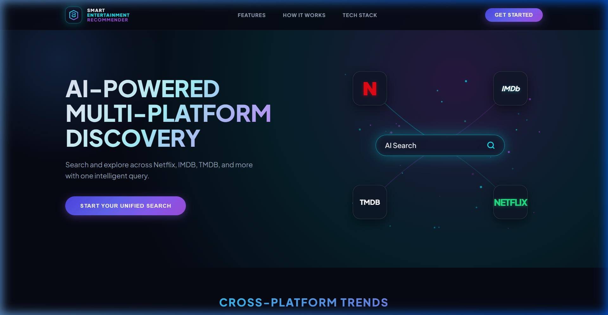
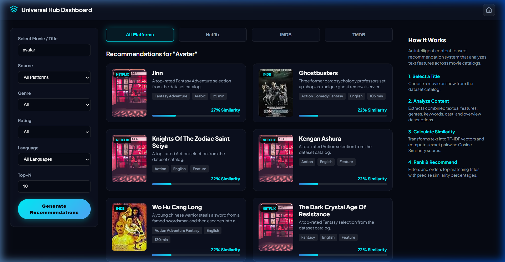
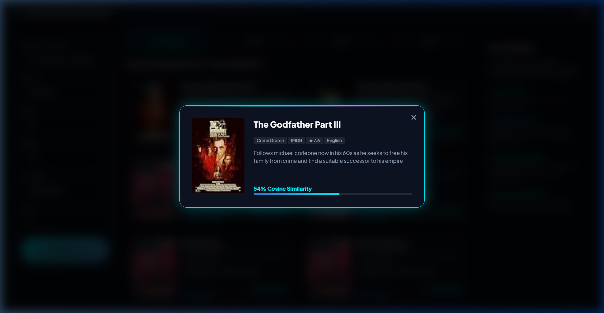

# 🎬 Smart Entertainment Recommendation System

[](https://piyushanand2006.github.io/Entertainment_Recommender/)
[](https://www.python.org/)
[](https://flask.palletsprojects.com/)
[](https://streamlit.io/)

> 🚀 **Live Web Application**: **[https://piyushanand2006.github.io/Entertainment_Recommender/](https://piyushanand2006.github.io/Entertainment_Recommender/)**

---

## 📖 About The Project

Finding what to watch across fragmented streaming platforms can be overwhelming. The **Smart Entertainment Recommendation System** bridges this gap by unifying datasets into a single search hub. 

It provides two core discovery modes:
1. **Title Similarity Recommendation**: Input any movie or show to discover textual matches with precise similarity percentages (e.g. `95% Similarity`).
2. **Genre & Catalog Browsing**: Explore top-rated titles filtered by genre (*Action*, *Animation*, *Drama*...), platform (*Netflix*, *IMDb*, *TMDB*), minimum rating threshold, and language.

---

## 🖼️ Application Screenshots

### 1. Landing Page (`Smart Entertainment Recommender`)
*Futuristic dark glassmorphism landing interface with dynamic particle light trail canvas and cross-platform trending carousel.*


---

### 2. Universal Hub Dashboard
*Multi-platform dashboard featuring interlocking Title/Genre dropdown selectors, platform tabs, and cyan similarity progress bars.*


---

### 3. Movie Detail Modal
*Interactive modal window showing detailed overview, source badges, metadata chips, and exact similarity metrics.*


---

## ✨ Key Features

- 🍿 **Unified Multi-Platform Catalog**: Aggregates 11,899+ records from **Netflix Originals**, **IMDb Top 1000**, and **TMDB Movie Datasets**.
- 🧠 **TF-IDF + Cosine Similarity Engine**: Natural Language Processing on combined features (*genres, keywords, cast, overview descriptions, language, duration*).
- 🔄 **Interlocking Smart Filters**:
  - Selecting a **Genre** automatically resets the **Title** to `None` and displays total matching titles in that genre.
  - Selecting a **Movie Title** automatically resets **Genre** to `All Genres` and triggers TF-IDF recommendation scoring.
- 🎯 **Metadata Filtering**: Filter recommendations by **Source** (*Netflix*, *IMDb*, *TMDB*), **Rating** (*8.0+*, *7.0+*...), **Language**, and **Top-N** result counts.
- 🎨 **Futuristic UI/UX**: Dark mode aesthetic (`#060913`), HSL glow effects, glassmorphic cards, responsive sidebar layout, and micro-animations.
- 🛡️ **Strict Content Accuracy**: 100% real dataset metadata with zero fabricated titles or corrupt strings.

---

## 🛠️ Tech Stack

- **Core & Backend**: Python 3.13, Flask, Flask-CORS
- **Machine Learning & Data**: scikit-learn (`TfidfVectorizer`, `cosine_similarity`), Pandas, NumPy
- **Frontend & Styling**: Modern Vanilla HTML5, CSS3 (Glassmorphism, CSS Grid/Flexbox), JavaScript (ES6+ Canvas Particle Animations)
- **Host & Runner**: Streamlit

---

## 📁 Project Structure

```
entertainment-recommender/
├── assets/                          # App screenshots and visual media
│   ├── landing_page.png
│   ├── dashboard.png
│   └── movie_modal.png
├── data/
│   └── processed/
│       └── entertainment_data.csv   # Unified & preprocessed dataset (11,899+ rows)
├── src/
│   ├── api_server.py                # Flask REST API server (/api/recommend, /api/meta, /api/trends)
│   ├── data_preprocessing.py        # Data loading, normalization, and feature engineering
│   ├── recommendation_engine.py     # TF-IDF vectorization & Cosine Similarity logic
│   └── static/                      # Frontend web application
│       ├── index.html               # Dual-page HTML template (Landing Page + Dashboard)
│       ├── styles.css               # Glassmorphic CSS design system
│       └── app.js                   # Client-side router, canvas animation, & API integration
├── app.py                           # Main Streamlit launcher & iframe container
├── requirements.txt                 # Project dependencies
└── README.md                        # Documentation
```

---

## 🚀 How to Use & Run Locally

### 1. Clone the Repository
```bash
git clone https://github.com/PiyushAnand2006/Entertainment_Recommender.git
cd Entertainment_Recommender
```

### 2. Install Dependencies
```bash
pip install -r requirements.txt
```

### 3. Generate Processed Dataset (Optional / Pre-packaged)
```bash
python src/data_preprocessing.py
```
*Processes `NetflixOriginals.xlsx`, `imdb_top_1000.xlsx`, and `TMDB_movie_dataset_v11.csv` into `data/processed/entertainment_data.csv`.*

### 4. Launch Application
Run the Streamlit application:
```bash
streamlit run app.py
```
Open your browser at `http://localhost:8501`. The backend API server will automatically start on `http://127.0.0.1:8502`.

---

## 🧮 Recommendation Algorithm

1. **Feature Engineering** (`src/data_preprocessing.py`):
   Combines `genre`, `keywords`, `cast`, `description`, `language`, `duration`, and `episodes` into a single normalized text feature vector `combined_features`.
2. **Vectorization** (`src/recommendation_engine.py`):
   Transforms `combined_features` into a sparse matrix using `TfidfVectorizer(stop_words='english')`.
3. **Similarity Scoring**:
   Computes pairwise dot product distances with `cosine_similarity(tfidf_matrix[query_idx], tfidf_matrix)`.
4. **Ranking & Filtering**:
   Sorts similarity scores descending, applies user metadata filters, and returns top-N matching recommendations.

---

## 📜 License

Distributed under the MIT License. See `LICENSE` for details.
